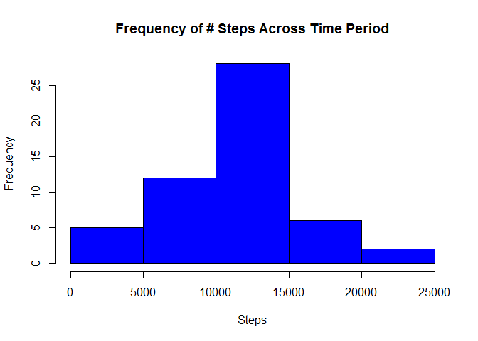
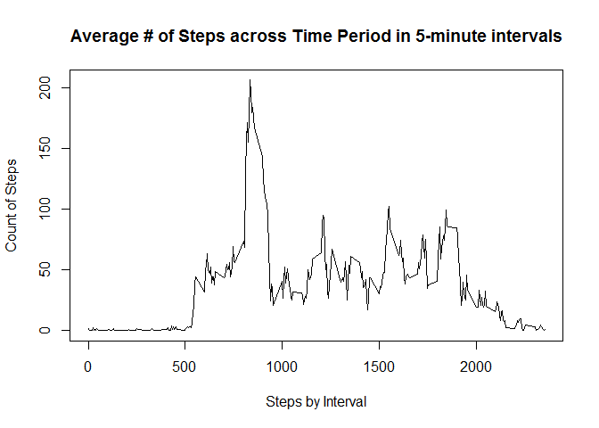
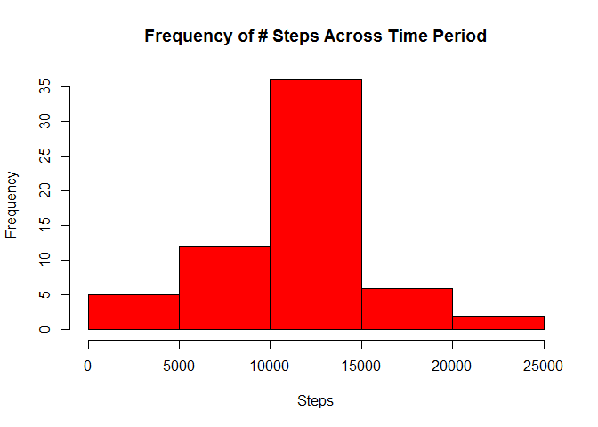
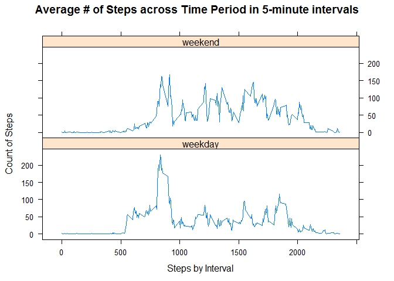

# Reproducible Research: Peer Assessment 1


## Loading and preprocessing the data

```r
#load ggplot library
require(ggplot2)
```

```
## Loading required package: ggplot2
```

```
## Warning: package 'ggplot2' was built under R version 3.2.1
```

```r
# read in the data and change the class of the date field
df <- read.csv("./activity.csv")
df$date <- as.Date(df$date)
```


The data variables included in this dataset are:  

* **steps**: Number of steps taking in a 5-minute interval (missing
    values are coded as `NA`)
* **date**: The date on which the measurement was taken in YYYY-MM-DD
    format
* **interval**: Identifier for the 5-minute interval in which
    measurement was taken

An example of the dataset is:

```
##   steps       date interval
## 1    NA 2012-10-01        0
## 2    NA 2012-10-01        5
## 3    NA 2012-10-01       10
## 4    NA 2012-10-01       15
## 5    NA 2012-10-01       20
## 6    NA 2012-10-01       25
```

## What is mean total number of steps taken per day?
Calculate the total number of steps taken per day, make a histogram from that total, and report the mean and median from that data.


```r
# summarize the data by date
stepsByDay <- aggregate(formula = steps~date, data = df, FUN = sum, na.rm=TRUE)

# plot total # of steps into a histogram
hist(stepsByDay$steps, col="blue", xlab="Steps", main="Frequency of # Steps Across Time Period")
```

 

```r
# calculate the mean # of steps
mean_orig <- mean(stepsByDay$steps , na.rm = TRUE)
mean_orig
```

```
## [1] 10766.19
```

```r
# calculate the median # of steps
med_orig <- median(stepsByDay$steps, na.rm = TRUE)
med_orig
```

```
## [1] 10765
```

## What is the average daily activity pattern?
Make a time series plot (i.e. type = "l") of the 5-minute interval (x-axis) and the average number of steps taken, averaged across all days (y-axis).


```r
# average by interval and rename headers
stepsByInterval <- aggregate(formula = steps~interval, data = df, FUN = mean ,na.rm=TRUE)
names(stepsByInterval) <- c("interval","steps")

# plot the series
plot(stepsByInterval$interval, stepsByInterval$steps, type="l", xlab = "Steps by Interval", 
     ylab = "Count of Steps", main = "Average # of Steps across Time Period in 5-minute intervals" )   
```

 

## Imputing missing values
Report total number of 'NA' values, outline strategy to impute data, create secondary dataset with missing values filled in, make a histogram from the new data, calculate mean and median of new data, and determine the impact of imputing the data.


```r
# calculate the number of NA's in the dataset
nrow(df[is.na(df$steps),])
```

```
## [1] 2304
```

My strategy for fixing the missing values will be to use the mean for the 5-minute interval previously calculated.

```r
# round down the steps to make whole integers
stepsByInterval$avgSteps <- floor(stepsByInterval$steps)

# merge the data into the original file
df_new <- df
df_new <- merge(df_new, stepsByInterval[,c('interval', 'avgSteps')], by="interval", all = TRUE)

# replace the steps where NA
df_new$steps <- ifelse(is.na(df_new$steps), df_new$avgSteps, df_new$steps)

# clean the data by removing the unnecessary column
df_new$avgSteps <- NULL

# re-calculate the number of NA's in the new dataset
nrow(df_new[is.na(df_new$steps),])
```

```
## [1] 0
```

Create a histogram of the new imputed data

```r
# summarize the data by date
stepsByDay_new <- aggregate(formula = steps~date, data = df_new, FUN = sum, na.rm=TRUE)

# plot total # of steps into a histogram
hist(stepsByDay_new$steps, col="red", xlab="Steps", main="Frequency of # Steps Across Time Period")
```

 

```r
# calculate the mean # of steps
mean_new <- mean(stepsByDay_new$steps , na.rm = TRUE)
mean_new
```

```
## [1] 10749.77
```

```r
# calculate the median # of steps
med_new <- median(stepsByDay_new$steps, na.rm = TRUE)
med_new
```

```
## [1] 10641
```

Differences between the original data set and the imputed data set?  From the table below, you can see that imputing the average by interval caused both the mean and median of the data to be reduced, thus we can infer that the total number of steps daily was reduced.


```
##              mean median
## original 10766.19  10765
## new      10749.77  10641
```

## Are there differences in activity patterns between weekdays and weekends?
Create a new factor variable in the dataset with two levels - "weekday" and "weekend" indicating whether a given date is a weekday or weekend day. Make a panel plot containing a time series plot (i.e. type = "l") of the 5-minute interval (x-axis) and the average number of steps taken, averaged across all weekday days or weekend days (y-axis).

```r
# add factor to reflect weekday or weekend
df_new$weekday <- factor(ifelse(weekdays(df_new$date) %in% c('Saturday', 'Sunday'), "weekend", "weekday"))

# recalculate the 5 minute interval average for each the factor
require(plyr)
```

```
## Loading required package: plyr
```

```
## Warning: package 'plyr' was built under R version 3.2.1
```

```r
stepsByInterval_new <- ddply(df_new, .(interval, weekday), summarise, aveSteps = mean(steps))

#plot using lattice library
require(lattice)
```

```
## Loading required package: lattice
```

```r
xyplot(aveSteps~interval | factor(weekday), data=stepsByInterval_new, type="l", 
       xlab = "Steps by Interval", ylab = "Count of Steps", 
       main = "Average # of Steps across Time Period in 5-minute intervals", layout=c(1,2))   
```

 
